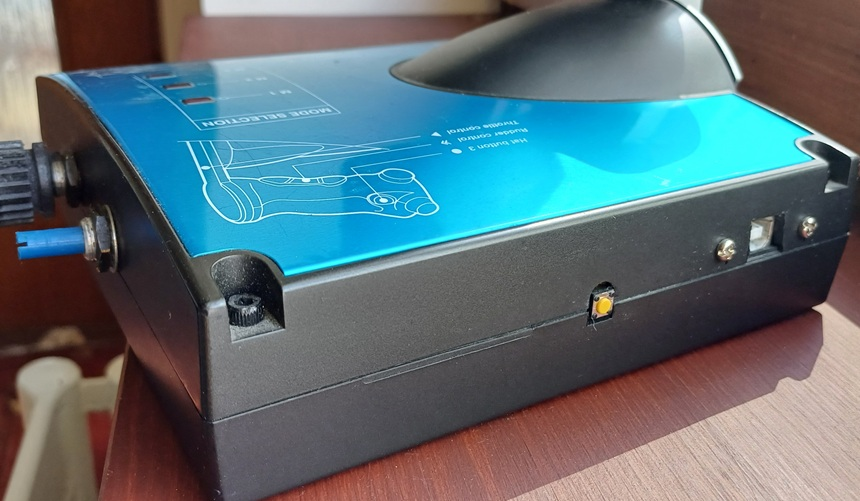

# Saitek X45 Throttle USB Mod

Get the X45 throttle unit running on its own (don't need the stick) on any machine (Windows, Linux, ...) without any custom drivers or special software on PC.

Overview:

 - Get Teensy 2.0++ microcontroller (or any Arduino compatible MCU with enough inputs)
 - Take the D15 cable off and rewire most of its pins to the microcontroller
 - Put [the code](x45arduino.ino) into the microcontroller
 - Connect to your PC and start using it

I built mine into the throttle unit itself so it exposes a standard USB connector.

The small yellow button is programming button for the Teensy, so it can be reprogrammed without opening the case. I also had two additional analog pots added to the side of the throttle base. They are purely optional extra in my own build and are not included in the code here. I used them as landing throttles in Elite Dangerour. Or as analog flaps and radiator cowls controls in IL-2.

## Basic Implementation

The Throttle unit has keyboard diode matrix for buttons, hats and mode switches.
  
Connecting throttle unit's D15 pins to Teensy (Arduino):

- button matrix rows 1-4 from D15 pins 7, 10, 14, 2 to Teensy D0-D3 (0-3)
- button matrix columns 1-4 from D15 pins 12, 15, 1, 9 to Teensy C0-D3 (10-13)
- Rotary 2 from D15 pin 3 to Teensy F0 (A0)
- Rotary 1 from D15 pin 6 to Teensy F1 (A1)
- Throttle from D15 pin 11 to Teensy F2 (A2)
- Rudder from D15 pin 13 to Teensy F3 (A3)
- D15 pin 8 to Teensy Vcc
- D15 pins 4 and 5 to Teensy GND
- D15 shield to Teensy's USB shield

X45's tri-state Mode switch (M1-M2-M3) makes all buttons and hats to have different
USB Joystick buttons in each mode. Except for the X45's tri-state Aux switch, which
is always mapped to issue button 31 when low, button 32 when high and nothing when
in the middle position.
